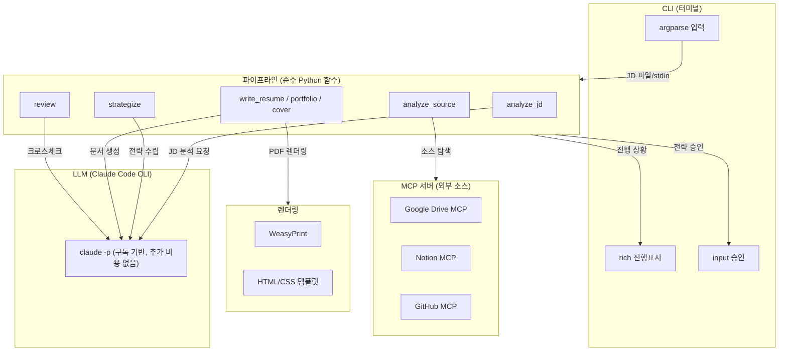

# MosaiqJob - 아키텍처 설계

## 시스템 구조



---

## LLM 호출 방식: Claude Code CLI

```python
import subprocess, json

def ask_claude(prompt: str) -> str:
    """Claude Code CLI를 통해 LLM 호출. 구독 범위 내 추가 비용 없음."""
    result = subprocess.run(
        ["claude", "-p", prompt, "--output-format", "json"],
        capture_output=True, text=True, timeout=120,
    )
    if result.returncode != 0:
        raise RuntimeError(f"Claude CLI 오류: {result.stderr}")
    response = json.loads(result.stdout)
    return response["result"]
```

### 장점
- **추가 비용 0원** — 이미 구독 중인 Claude 활용
- **API 키 불필요** — Claude Code CLI가 인증 처리
- **의존성 대폭 감소** — `crewai`, `crewai-tools`, `litellm` 등 제거

---

## 파이프라인 설계 (순수 Python 함수)

### 에이전트 함수

```python
# agents/analyst.py
from pathlib import Path
from agents.llm import ask_claude

PROMPT = (Path(__file__).parent.parent / "prompts" / "analyst.md").read_text()

def analyze_jd(jd_text: str) -> str:
    prompt = f"{PROMPT}\n\n## 채용공고 원문\n{jd_text}"
    return ask_claude(prompt)
```

### Step 정의

| Step | 함수 | 입력 | 출력 |
|---|---|---|---|
| **JD 분석** | `analyst.analyze_jd(jd_text)` | JD 텍스트 | `JDAnalysis` JSON |
| **소스 분석** | `source.analyze_source(keywords)` | 키워드 | `SourceData` JSON |
| **전략 수립** | `strategist.strategize(jd, src)` | JD분석 + 소스 | `Strategy` JSON |
| **이력서** | `writer.write_resume(strategy, src, jd)` | 전략 + 소스 + JD | 이력서 HTML |
| **포트폴리오** | `writer.write_portfolio(strategy, src, resume)` | 전략 + 소스 + 이력서 | 포트폴리오 HTML |
| **자소서** | `writer.write_cover(strategy, jd, resume, portfolio, questions)` | 전략 + JD + 이력서 + 포폴 + 문항 | 자소서 HTML |
| **크로스체크** | `reviewer.review(jd, resume, portfolio, cover, questions)` | 전체 문서 | `CrossCheckResult` JSON |

### 파이프라인 실행 (app.py)

파이프라인 클래스 없이 `app.py`에서 에이전트 함수를 직접 순차 호출한다.

```python
from agents import analyst, source, strategist, writer, reviewer
from renderer.pdf import html_to_pdf

def run_pipeline(jd_text, questions, auto=False):
    jd_analysis = analyst.analyze_jd(jd_text)
    keywords = extract_keywords(jd_analysis, jd_text)
    source_data = source.analyze_source(keywords)
    strategy = strategist.strategize(jd_analysis, source_data)

    # 사용자 승인 (--auto 플래그 시 생략)
    if not auto and not confirm(strategy):
        return

    resume = writer.write_resume(strategy, source_data, jd_analysis)
    portfolio = writer.write_portfolio(strategy, source_data, resume)
    cover = writer.write_cover(strategy, jd_analysis, resume, portfolio, questions)
    review_result = reviewer.review(jd_analysis, resume, portfolio, cover, questions)

    # PDF 출력
    for name, html in [("이력서", resume), ("포트폴리오", portfolio), ("자소서", cover)]:
        html_to_pdf(html, output_dir / f"{name}.pdf")
```

---

## MCP 서버 구성

| MCP 서버 | 용도 | 인증 |
|---|---|---|
| **Google Drive MCP** | 기존 이력서/포폴/자료 파일 탐색 | Google OAuth |
| **Notion MCP** | 프로젝트 기록, 개인 정보 페이지 | Notion Integration Token |
| **GitHub MCP** | 개인/org 레포 목록 + README | GitHub PAT |

MCP 서버는 `claude mcp add`로 영구 등록되어 있으므로, `claude -p` 호출 시 `--allowedTools` 플래그로 접근을 제어한다.

---

## 데이터 모델

```python
# models/schemas.py — Pydantic v2

class JDAnalysis:
    company_name, position, requirements[], preferred[], keywords[], company_info

class SourceData:
    experiences[], projects[], skills[], education[], certifications[]

class Strategy:
    match_rate, match_comment, storyline, requirement_mapping[], highlight_projects[], highlight_reasons[]

class Documents:
    resume_html, portfolio_html, cover_letter_html

class CrossCheckResult:
    consistency_issues[], uncovered_requirements[], duplicate_expressions[],
    spelling_issues[], char_count_ok, ai_detection_risk, overall_pass
```

---

## CLI 인터페이스

### 사용법

```bash
# JD 파일로 실행
mosaiq jd.txt

# 자소서 문항 포함
mosaiq jd.txt -q questions.txt

# stdin으로 JD 입력
cat jd.txt | mosaiq

# 승인 없이 자동 진행
mosaiq jd.txt --auto

# 출력 디렉토리 지정
mosaiq jd.txt -o ~/Documents/삼성전자/
```

### 진행 표시 (rich)

```
$ mosaiq jd.txt

[1/7] JD + 기업 분석 중... ⠋
  → 삼성전자 로봇사업부 / 로봇 SW 엔지니어
  → 요구: ROS2, C++, Python | 우대: SLAM, 협동로봇

[2/7] 소스 수집 중 (Notion/GitHub)... ⠋
  → Notion 5건, GitHub 8레포 확인

[3/7] 전략 수립 중... ⠋
  → 매칭률: 78%
  → 강점: ROS2 실무, 코봇+AGV 통합 경험
  → 약점: SLAM 경험 부족 → Octomap 매핑으로 보완

진행할까요? (Y/n): y

[4/7] 이력서 생성 중... ⠋
[5/7] 포트폴리오 생성 중... ⠋
[6/7] 자소서 생성 중... ⠋
[7/7] 크로스체크 중... ⠋

✓ 완료! output/ 디렉토리에 PDF 3종 생성됨
  - output/이력서.pdf
  - output/포트폴리오.pdf
  - output/자소서.pdf
```

---

## 프로젝트 디렉토리 구조

```
MosaiqJob/
├── PIPELINE.md              # 파이프라인 정의
├── ARCHITECTURE.md          # 아키텍처 설계 (이 문서)
│
├── app.py                   # CLI 엔트리포인트 (argparse + rich)
│
├── agents/
│   ├── __init__.py
│   ├── llm.py               # ask_claude() — Claude CLI 래퍼
│   ├── analyst.py            # analyze_jd() 함수
│   ├── source.py             # analyze_source() 함수
│   ├── strategist.py         # strategize() 함수
│   ├── writer.py             # write_resume/portfolio/cover() 함수
│   ├── reviewer.py           # review() 함수
│   └── mcp_tools.py          # MCP 서버 파라미터 관리
│
├── models/
│   ├── __init__.py
│   └── schemas.py            # Pydantic 데이터 모델
│
├── renderer/
│   ├── __init__.py
│   └── pdf.py                # WeasyPrint PDF 렌더링
│
├── templates/                # HTML/CSS 템플릿
├── prompts/                  # 프롬프트 파일
│
├── tests/                    # 테스트
├── pyproject.toml            # 의존성
└── output/                   # 생성된 PDF 출력
```

---

## 의존성

```toml
[project]
name = "mosaiqjob"
version = "0.2.0"
requires-python = ">=3.10"

dependencies = [
    "weasyprint",              # PDF 렌더링
    "jinja2",                  # HTML 템플릿
    "pydantic>=2.0",           # 데이터 모델
    "python-dotenv",           # 환경변수
    "rich",                    # CLI 진행표시/출력
]

[project.scripts]
mosaiq = "app:main"            # `mosaiq` 명령어로 실행
```

### 제거된 의존성
- ~~chainlit~~ → rich (CLI 전환)
- ~~mcp~~ → Claude CLI가 MCP 처리
- ~~pytest-asyncio~~ → async 제거
- ~~crewai[tools]~~ → 순수 Python 함수
- ~~anthropic~~ → Claude CLI 사용

---

## 실행 방법

```bash
# 사전 요구사항: Claude Code CLI 설치 + 구독 로그인
claude --version  # 설치 확인

# 의존성 설치
pip install -e .

# 실행
mosaiq jd.txt
```
