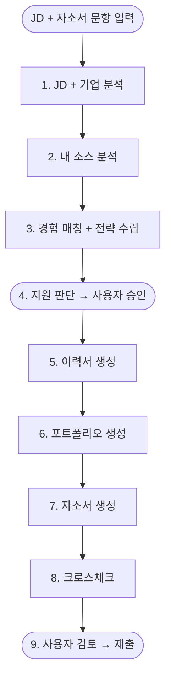

# MosaiqJob - 취업 문서 자동화 파이프라인

## 프로젝트 개요

로봇/AI 엔지니어 이직을 위한 개인용 문서 자동화 도구.
트리거와 최종 검토만 사용자가 하고, 나머지는 AI Agent가 전부 수행한다.

---

## 핵심 전략

### 서술 원칙
- 성과 수치가 아닌 **의사결정 근거** 중심 서술
- 솔직 담백, 과장 없이, AI스럽지 않은 진솔한 톤
- **"이런 상황에서, 이런 이유로, 이렇게 했다, 그래서 이런 결과가 나왔다"** (STAR 변형)
- 결과는 정량적 수치가 아니어도 됨 (예: "안정적으로 동작했다", "이후 확장이 수월했다")

### 문서 간 역할
| 문서 | 역할 | 톤 | 주의사항 |
|---|---|---|---|
| 이력서 | 팩트 요약. 경력/학력/기술 한눈에 (10~30초 안에 읽힘) | 간결, 정보 밀도 높게 | JD 키워드 순서로 기술 배치. 직무 무관 자격증 제외 |
| 포트폴리오 | 프로젝트 상세. 의사결정 근거 중심 | 기술적 깊이 + 솔직한 이유 | 1페이지 임팩트 요약 필수. 첫인상에서 승부 |
| 자소서 | 이력서+포폴에 없는 맥락/동기/가치관. 기업 맞춤 | 진솔, 설득력 있게 | 이력서/포폴 내용 반복 금지. 빈 공간을 채우는 역할 |

### 자소서가 다뤄야 할 3가지
1. **왜 이 회사/직무인가** — JD 키워드와 내 경험 연결
2. **왜 나인가** — 포폴에서 다 못 한 맥락, 동기, 가치관
3. **왜 지금인가** — 커리어 방향성과 이 포지션의 연결

### 포트폴리오 구성
```
1페이지:   임팩트 요약 (나는 누구, 핵심 역량 3가지, 프로젝트 한눈에)
2~3페이지: 강조 프로젝트 (프로젝트당 1페이지, 최대 2개)
           - 상황 → 판단 근거 → 행동 → 결과
           - 기술 아키텍처 다이어그램 1개
           - 본인 기여도 명확히
4페이지:   나머지 프로젝트 카드섹션 (간략 소개)
```

### 기업 맞춤
- 프로젝트 선별을 기업/직무별로 다르게
- 공고 키워드를 자연스럽게 반영
- 과장/포장 절대 금지, 강조점만 조절
- 한국 조직 문화에 맞는 톤 (미국식 자신감 과잉 주의)

---

## 파이프라인 (MVP)

```
JD+기업분석 → 내 소스 분석(MCP) → 매칭+지원판단 → 이력서 → 포폴 → 자소서 → 크로스체크 → 검토
```

### 플로우차트



### 1. JD + 기업 분석
- 요구역량 / 우대사항 / 키워드 추출
- 채용 배경 추론 (충원/신설/확장)
- 기업 뉴스 / 기술스택 / 문화 분석
- 연봉/처우 정보 (공개된 경우)

### 2. 내 소스 분석
- MCP로 매번 소스 전체 탐색 (Google Drive, OneDrive, Notion, GitHub)
- JD 키워드 기반 관련 자료 우선 탐색
- 카테고리별 수집: 프로젝트, 경력, 기술 스택, 자격증, 수상 이력 등
- 시간이 좀 더 걸려도 항상 최신 + 풍부한 소스 확보

### 3. 경험 매칭 + 전략 수립
- JD 요구사항 하나하나에 내 경험 1:1 대응
- 충족 / 부족 분류 (없는 건 솔직하게 없다고 표기)
- 3개 문서를 관통하는 스토리 라인 한 문장
- 강조 프로젝트 2개 선정 + 선정 근거

### 4. 지원 판단 → 사용자 승인
- 매칭률 + 코멘트 → **사용자 승인 시 문서 생성 진행**

### 5. 이력서 생성 → PDF
- 형식: A4 1~2페이지 (신입~주니어 1장, 경력 2장)
- 인적사항: 이름, 연락처, 이메일, GitHub URL
- 사진: 기업에 따라 필요 (한국 관행)
- 상단 경력 요약문 2~3줄 (스토리 라인 반영)
- 경력: 회사명/부서/직책/기간 + 핵심 행동 1줄
- 프로젝트: 프로젝트명/기간/사용 기술/한 줄 설명 (목록 수준, 상세는 포폴에서)
- 기술 스택: 언어, 프레임워크, 도구, 하드웨어 카테고리별 나열 (본인이 많이 쓴 순)
- 학력/자격증: 직무 관련 것만
- 경력/프로젝트는 시간순 배치
- 직무 무관 항목 제외

### 6. 포트폴리오 생성 → PDF
- 1p 임팩트 요약:
  - 경력 요약문과 동일 톤
  - 핵심 역량 3가지 키워드
  - 전체 프로젝트 한눈에 보는 목록
- 2~3p 강조 프로젝트 (각 1페이지, 전략에서 선정 근거 인계):
  - 프로젝트 개요 1~2줄
  - 상황: 어떤 문제/과제가 있었는가
  - 판단: 왜 이 방식을 택했는가 (대안도 언급)
  - 행동: 구체적으로 뭘 했는가
  - 결과: 어떻게 됐는가 (솔직하게)
  - 기술 아키텍처 다이어그램 1개
  - 사용 기술 태그
  - 본인 기여도 (팀 프로젝트인 경우)
- 4p 나머지 카드섹션:
  - 프로젝트당 카드 1개: 이름/한 줄 설명/기술 태그/기간
  - 3~4개가 적당
- 전체 톤: 글보다 구조로 보여주기 (다이어그램, 태그, 불릿). 장문 서술 금지.

### 7. 자소서 생성 → PDF
- 이력서/포폴 내용 반복 금지
- 같은 경험이라도 다른 각도로 (이력서: 팩트, 포폴: 기술 깊이, 자소서: 동기와 맥락)
- 문항 맞춤형:
  - 두괄식: 핵심 메시지를 먼저 → 근거로 뒷받침
  - 문항 의도 파악 → 핵심 메시지 1개 → 근거 2~3개
  - 근거는 반드시 실제 경험에서 (이력서/포폴에 근거가 있어야 함)
  - 글자수 제한에 따라 구조 조절:
    - 500자: 메시지 1개 + 근거 1개
    - 1000자: 메시지 1개 + 근거 2~3개
    - 제한 없음: 자유형 구조와 동일
- 자유형 (전체 800~1200자):
  - 도입: 왜 이 회사/직무인가
  - 본론: 왜 나인가 (프로젝트 에피소드 1~2개)
  - 마무리: 왜 지금인가 + 입사 후 기여 방향
- 공통:
  - "~하겠습니다" 남발 금지 (미래 다짐보다 과거 행동이 설득력 있음)
  - 존댓말 통일 (합쇼체 또는 해요체, 섞지 않기)

### 8. 크로스체크
- 3개 문서에서 경력 날짜/회사명/직책 일치 여부
- 이력서에 쓴 기술이 포폴 프로젝트에 실제 등장하는가
- 자소서에서 언급한 경험이 이력서/포폴에 근거가 있는가
- JD 필수 요구사항 중 어디에도 언급 안 된 항목 확인
- 자소서 글자수 제한 이내 여부
- 동일 표현 반복 검출 (세 문서 통틀어 같은 문장 쓰고 있지 않은가)
- 맞춤법 / 톤 일관성 / AI탐지 리스크

### 9. 사용자 검토 → 제출
- AI가 검토 가이드 제공:
  - "이력서 상단 요약문이 본인 느낌과 맞는지 확인하세요"
  - "자소서 첫 문장이 마음에 드시나요?"
  - "포폴에서 강조한 프로젝트가 적절한가요?"
  - "전체적인 톤이 본인답게 느껴지나요?"
- PDF 다운로드 → 제출

---

## 기술 스택

```
LLM: Claude Code CLI (claude -p, 구독 기반 — 추가 API 비용 없음)
문서 렌더링: WeasyPrint (HTML/CSS → PDF 통일)
외부 연동: MCP 서버 (Google Drive, Notion, GitHub)
UI: CLI (argparse + rich)
파이프라인: 순수 Python 함수
```

---

## AI 인터뷰 (초기 품질 향상)

MCP로 소스를 수집한 뒤, AI 인터뷰로 의사결정 근거를 보강한다.

### 질문 설계 원칙
막연한 "왜?"가 아닌 구체적 질문으로 의사결정 근거를 추출한다:
```
"ROS1도 있었는데 왜 ROS2를 선택했나요? 당시 다른 선택지는 뭐였나요?"
"AGV와 코봇을 통합할 때 가장 어려웠던 기술적 판단은 뭐였나요?"
"이 프로젝트를 다시 한다면 다르게 할 부분이 있나요? 왜요?"
"이 기술을 쓰기로 결정할 때 어떤 대안을 비교했나요?"
```

---

## 고도화 (MVP 이후)
- 채용공고 크롤링 (사람인/잡코리아, 수동 트리거)
- 매칭 점수 산출 알고리즘
- 멀티 LLM 역할 분배 (GPT: JD 분석, Gemini: 기업 정보/검수)
- 생성 히스토리 관리
- 피드백 루프 (면접 결과 → 프롬프트 개선)
- 기업 유형별 포맷 대응 (대기업 자체 양식 등)

---

## 미결 사항
- [x] ~~API 키 발급~~ → Claude Code CLI 구독으로 대체 (추가 비용 없음)
- [x] ~~MCP 서버 연동 테스트~~ → Notion, GitHub 연결 완료
- [ ] AI 인터뷰 질문 세트 상세 설계
- [x] ~~웹 UI → CLI 전환~~ → argparse + rich
- [x] ~~크로스체크 검증 기준 정의~~ → PIPELINE.md 8단계에 명시
- [x] ~~포트폴리오 PDF 레이아웃/디자인~~ → templates/portfolio.html
- [x] ~~CrewAI → Claude CLI 마이그레이션~~ → 완료
- [ ] Chainlit → CLI 전환 (ARCHITECTURE.md 참조)
